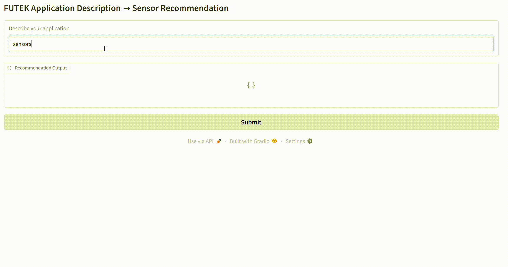

# Sensors, Semantic Relevancy, and APIs

**12/19/2025, Written By Ian Wells**

This project uses APIs and semantic relevancy to connect an engineer’s application description to relevant website URLs from [FUTEK.com](https://www.futek.com/home)



---

## Focus
- **Semantic Relevancy Search, Cosine Similarity**
- **FastAPI, Python, Gradio**

---

## Background
FUTEK manufactures load cells, torque sensors, and pressure sensors to enable precision measurement through configuration of [Strain Gauge's](https://en.wikipedia.org/wiki/Strain_gauge).

There are hundreds of sensing applications. Engineers can use sensors for test and measurement, quality control, force feedback, automation, robotics….the list goes on.  

To lend perspective on what Is possible, FUTEK provides ~250 [application landing pages](https://www.futek.com/applications). From an SEO perspective, these are accessible via Google, Safari, even Bing. On FUTEK’s website however, navigating through hundreds of applications is not possible via the current internal search (planned for future development). 

Let’s design a search tool to change that.

---

## System Design
- **Customer input:** a short description of their application (ie: Laparoscopic Gripper, Robotics, Space Rated Load Cells, etc…)  
- **Application page data:** the 250+ application titles, notes, and URLs stored in JSON  
- **Relevance Algorithm:** based on the provided application description, we design an algorithm to output the top K most relevant URLs to our input query  
- **An API:** to allow communication between an end user and our backend (making it easy for a web dev team to implement the search tool, [*winking face emoji*] in case you want to implement this @FUTEK_Web_Team).


## Semantic Search

**How does this make you feel?**  
*You are not good enough.*  

**And this, how do you feel after reading this?**  
*Try harder.* 

Both phrases make me feel inadequate, with the silver lining being that each phrase is **semantically similar**.  

A pretrained embedding model expresses its feelings in **vectors**. Specifically, passing the string **“You are not good enough.”** through an embedding model will output a **multi-dimensional vector** (fancy for a really long list of numbers).  

If we do the same for **“Try Harder”** and compare these vectors mathematically, we can assign relevancy or **“how close”** the phrases are in meaning.  

---

### Design of Semantic Algorithm

1. **Use an embedding model** (pretrained language model) to store a semantic vector for each application title that FUTEK has on their website.  We are using all-MiniLM-L6-v2 from Sentence Transformers, a lightweight and free to download model. 
2. **During the application run**, have a user input text and embed this as a query vector.  
3. **Looping through all application vectors** (O(N) time complexity), perform a cosine similarity between query and application vectors, store the comparisons as scores.  
   - **[Cosine Similarity](https://en.wikipedia.org/wiki/Cosine_similarity)**, in our case, is the dot product of two embeddings, under the assumption each vector is normalized (unit length has a magnitude of 1).  
4. **Sort these comparisons by score**, output the top results to see the best matches.  

By the way, **you are good enough**.  

### The Code, Comments Heavy

**Embed the application titles.**

```python
from sentence_transformers import SentenceTransformer
import json

#Load Our Embedding Model
model = SentenceTransformer("all-MiniLM-L6-v2")

#Load our website application data
with open("results.json", "r", encoding="utf-8") as f:
    data = json.load(f)

#Grab the titles from each website application card
titles = [item["title"] for item in data]

#Embed all titles, and normalize each vector
title_embeddings = model.encode(
    titles,
    normalize_embeddings=True,
    show_progress_bar=True
)

results_with_embeddings = []

#Loop through all the data and embeddings, zip them up and append to results
for item, emb in zip(data, title_embeddings):
    results_with_embeddings.append({
        "title": item["title"],
        "url": item["url"],
        "embedding": emb.tolist()  # convert numpy → JSON-safe
    })

#Dump to JSON
with open("futek_title_embeddings.json", "w", encoding="utf-8") as f:
    json.dump(results_with_embeddings, f, indent=2)
```

**Semantic Comparison Algorithm**

```python
#Takes a string describing an application, outputs list of order k matches
def match_application(application_title: str, top_k: int = 5):
    #Readable Metadata
    records = app.state.embedding_records
    #Vector Embeddings
    embeddings = app.state.embeddings    

    #If top k is larger than the number of records, cap so we don't index beyond array and cause memory fault
    top_k = min(top_k, len(records))

    #Convert the application title into a vector and normalize (unit magnitude of 1)
    query_embedding = model.encode(
        application_title,
        normalize_embeddings=True
    )

    #Dot product of query and embeddings, [N, D] * [D] = [N] sized array
    scores = embeddings @ query_embedding

    #argsort() sorts indices by lowest to highest value, [-top_k:] is back of the array, [::-1] flips the array so highest is first
    top_idx = scores.argsort()[-top_k:][::-1]

    #Grabs the human readable data from the records using the indices, stores as a list of dictionaries 
    results = []
    for i in top_idx:
        results.append({
            "matched_title": records[i]["title"],
            #Fun fact: .get("url") functions same as ["url"], but returns None if URL is missing
            "url": records[i].get("url"),
            "score": float(scores[i])
        })

    return results
```
---

## API Design

We are using **FASTApi** to design a connection between our text input and backend semantic search.

```python
#FastAPI handles HTTP routing, Request parsing, JSON serialization, etc..
from fastapi import FastAPI
app = FastAPI()

#Pydantic will help us enforce types by returning helpful errors
from pydantic import BaseModel

#Production grade health check. Simply checks if the server is up and responding. 
@app.get("/")
def health():
    return {"status": "ok"}

#defines the expected text, using pydantic
class TextRequest(BaseModel):
    text: str

#loads the vectors and titles from our database upon startup, converts the embeddings to a NumPY matrix
@app.on_event("startup")
def load_embeddings():
    #app.state is FasTAPIs official place to store shared, long-lived application data
    app.state.embedding_records = load_json("futek_title_embeddings.json")
    app.state.embeddings = np.array(
        [r["embedding"] for r in app.state.embedding_records]
    )

#Side note on app state:
#Data that takes time to load can be stored in app.state upon start up.  In reality, this data lives on your server's RAM
#So if you exceed RAM, that is where problems will occur
#One common nuance/mistake to look for is in uvicorn main:app --workers 4
#here we have 4 workers, so the API can be called at the same time up to x4 (they are just like CPU cores)

#Sending an application description
@app.post("/application_description")
def post_app_description(request: TextRequest):
    user_text = request.text
    result = match_application(user_text)
    return result

```
---

Thanks for reading 😊  

If you’d like to learn more or design your own semantic search tool, take a look at the **[repo](https://github.com/IanCWells/SemanticRelevancy)** for this project. 
